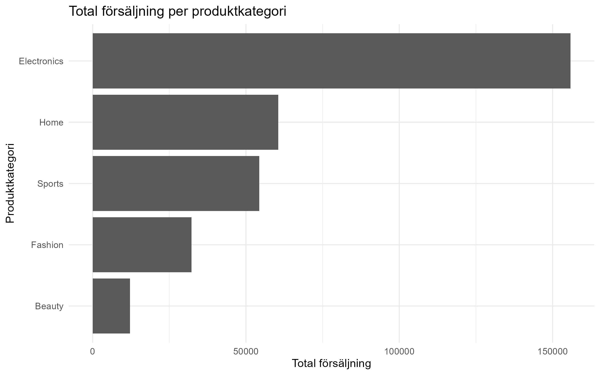
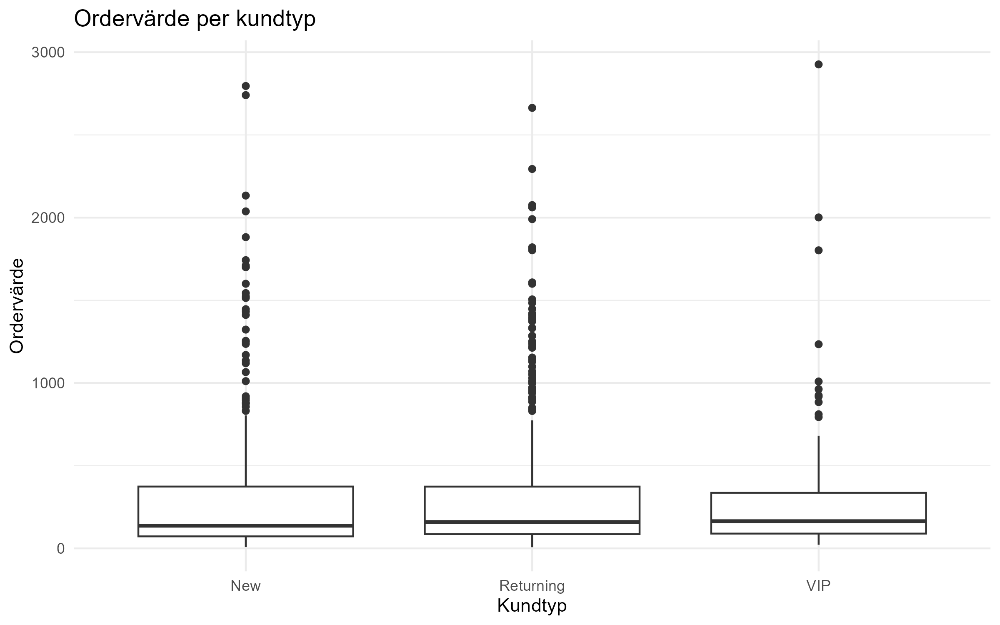
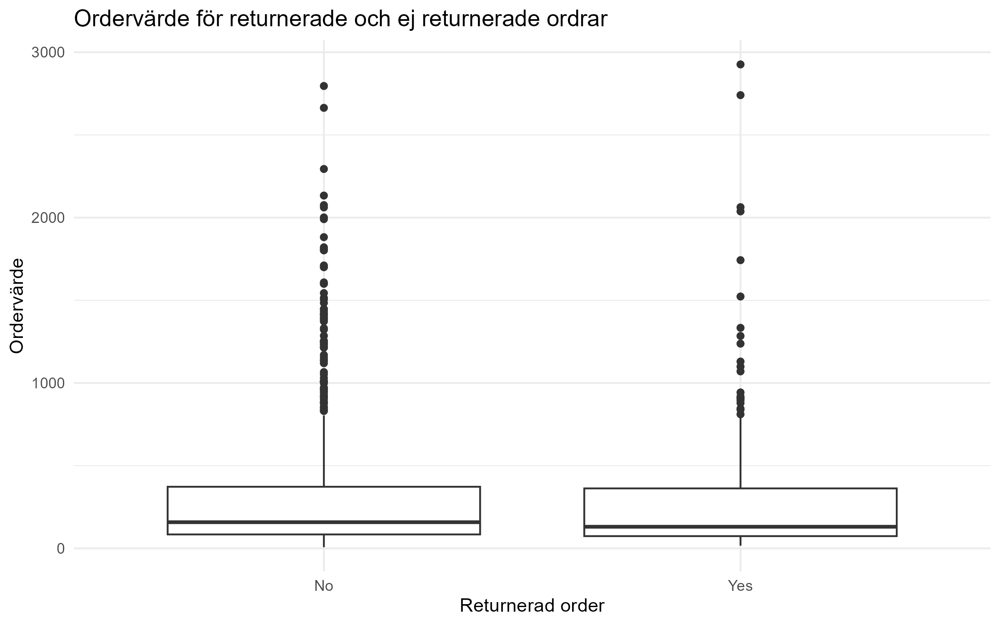
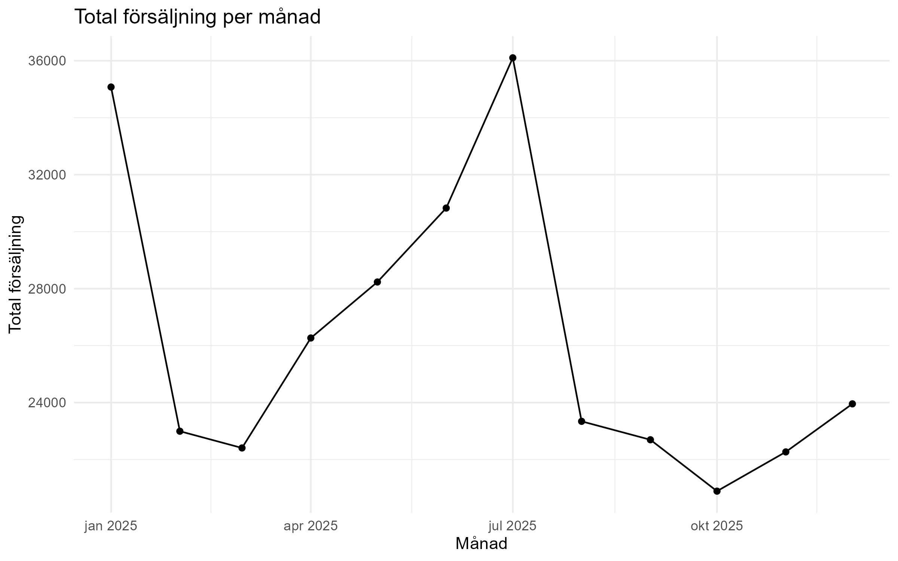
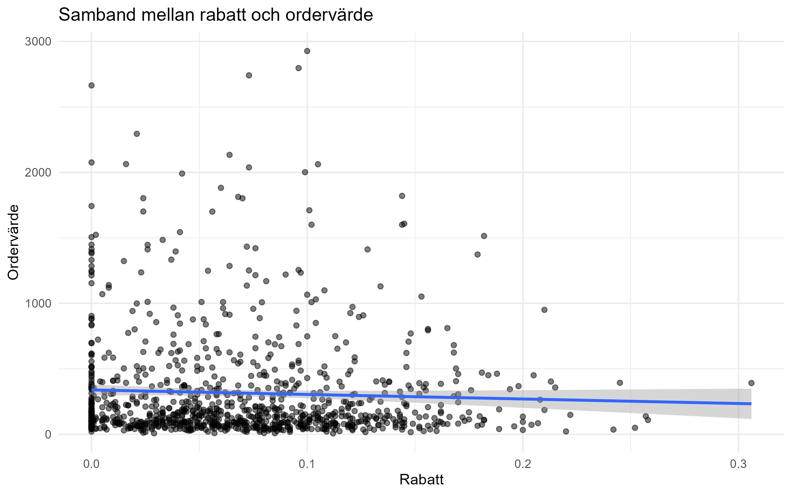
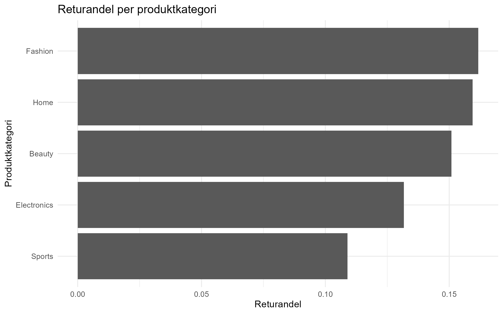

# Rapport: Analys av e-commerce orders

## Inledning

I det här projektet analyserar jag ett dataset med e-handelsordrar. Uppgiften var egentligen tänkt som en gruppuppgift, men jag genomför den individuellt.

Syftet med analysen är att undersöka försäljning, kundtyper, produktkategorier, returer och ordervärde. Jag använder R och tidyverse för att importera, städa, analysera och visualisera datan.

Jag vill framför allt undersöka:

* vilka produktkategorier som står för högst försäljning
* om ordervärde skiljer sig mellan olika kundtyper
* om returnerade ordrar skiljer sig från ej returnerade ordrar
* om rabatt har ett samband med ordervärde
* om ordervärde kan förklaras med hjälp av flera variabler i en regressionsmodell

## Dataset

Datasetet består av 1000 rader och 16 ursprungliga kolumner. Varje rad motsvarar en order.

Exempel på variabler i datasetet är orderdatum, kundtyp, region, stad, produktkategori, betalningsmetod, antal produkter, pris, rabatt, leveranstid och om ordern returnerades eller inte.

Jag började med att importera datasetet och granska struktur, kolumnnamn, datatyper och saknade värden. Jag såg att vissa kolumner hade saknade värden, bland annat city, payment_method, campaign_source, discount_pct och shipping_days.

## Datastädning

I datastädningen gjorde jag följande:

* tog bort extra mellanslag i textvariabler
* gjorde textvärden mer enhetliga
* fyllde saknade värden i city, payment_method och campaign_source med Unknown
* ersatte saknad rabatt med 0
* ersatte saknad leveranstid med medianvärdet
* skapade nya variabler för analys

De nya variablerna jag skapade var:

* gross_order_value
* discount_amount
* order_value
* returned_binary
* order_month

Variabeln order_value är viktig i analysen eftersom den visar orderns värde efter rabatt.

## Explorativ analys

Efter datastädningen gjorde jag en explorativ analys med dplyr.

Totalt innehåller datan 1000 ordrar. Den totala försäljningen efter rabatt är ungefär 315 056. Det genomsnittliga ordervärdet är ungefär 315 och medianvärdet är ungefär 152. Returandelen är ungefär 14,4 %.

När jag jämförde produktkategorier såg jag att Electronics hade högst total försäljning. Det är också den kategori som hade högst genomsnittligt ordervärde. Beauty hade lägst total försäljning och lägst genomsnittligt ordervärde.

Sammanfattning per produktkategori:

* Electronics: högst total försäljning, cirka 155 811
* Home: cirka 60 569
* Sports: cirka 54 312
* Fashion: cirka 32 207
* Beauty: cirka 12 156

När jag jämförde kundtyper såg jag att nya kunder hade högst genomsnittligt ordervärde. Returning customers stod däremot för högst total försäljning eftersom de var flest i datasetet.

Genomsnittligt ordervärde per kundtyp:

* New: cirka 343
* Returning: cirka 311
* VIP: cirka 284

Det betyder inte automatiskt att nya kunder alltid är mest värdefulla, eftersom antalet kunder också spelar roll. Returning customers hade flest ordrar och stod därför för störst total försäljning.

## Visualiseringar

Jag skapade flera diagram med ggplot2 för att undersöka datan visuellt. Diagrammen hjälper mig att se skillnader mellan grupper och samband mellan variabler.

### Total försäljning per produktkategori

Det här diagrammet visar total försäljning per produktkategori. Electronics står för högst total försäljning i datasetet.

### Ordervärde per kundtyp

Det här boxplot-diagrammet visar hur ordervärdet skiljer sig mellan olika kundtyper. Nya kunder har högst genomsnittligt ordervärde, men det finns också stor variation inom grupperna.

### Ordervärde för returnerade och ej returnerade ordrar

Det här diagrammet jämför ordervärde mellan returnerade och ej returnerade ordrar. Skillnaden ser inte jättestor ut, vilket också stämmer med t-testet senare i rapporten.

### Total försäljning per månad

Det här diagrammet visar hur försäljningen varierar mellan månaderna. Det gör det lättare att se om vissa månader sticker ut.

### Samband mellan rabatt och ordervärde

Det här diagrammet visar sambandet mellan rabatt och ordervärde. Linjen visar en enkel regressionslinje. Sambandet verkar inte vara särskilt starkt, vilket också syns i den enkla regressionen.

### Returandel per produktkategori

Det här diagrammet visar returandel per produktkategori. Det gör det lättare att jämföra vilka kategorier som har högre eller lägre andel returnerade ordrar.

## T-test och konfidensintervall

Jag gjorde tre t-test för att jämföra grupper.

### Ordervärde för returnerade och ej returnerade ordrar

Jag jämförde ordervärde mellan returnerade och ej returnerade ordrar.

Medelvärdet för ej returnerade ordrar var ungefär 311. Medelvärdet för returnerade ordrar var ungefär 341.

T-testet gav ett p-värde på ungefär 0,487. Eftersom p-värdet är större än 0,05 kan jag inte säga att skillnaden är statistiskt signifikant.

Min tolkning är att det inte finns tillräckligt stöd i datan för att säga att returnerade och ej returnerade ordrar har olika ordervärde.

### Ordervärde för nya och återkommande kunder

Jag jämförde ordervärde mellan nya kunder och återkommande kunder.

Medelvärdet för nya kunder var ungefär 343. Medelvärdet för återkommande kunder var ungefär 311.

T-testet gav ett p-värde på ungefär 0,353. Eftersom p-värdet är större än 0,05 är skillnaden inte statistiskt signifikant.

Min tolkning är att nya kunder hade ett högre genomsnittligt ordervärde i datan, men att skillnaden inte är tillräckligt stark statistiskt för att dra en säker slutsats.

### Rabatt för returnerade och ej returnerade ordrar

Jag jämförde rabatt mellan returnerade och ej returnerade ordrar.

Ej returnerade ordrar hade en genomsnittlig rabatt på ungefär 6,7 %. Returnerade ordrar hade en genomsnittlig rabatt på ungefär 7,7 %.

T-testet gav ett p-värde på ungefär 0,059. Det är nära 0,05 men fortfarande lite över gränsen.

Min tolkning är att returnerade ordrar verkar ha något högre rabatt i datan, men resultatet är inte statistiskt signifikant på 5 %-nivån.

## Regression

Jag gjorde både enkel och multipel linjär regression.

### Enkel regression

I den enkla regressionen undersökte jag om rabatt kunde förklara ordervärde.

Modellen var:

order_value förklaras av discount_pct.

Resultatet visade att rabatt ensam nästan inte förklarade variationen i ordervärde. R-squared var ungefär 0,002 och p-värdet var ungefär 0,155.

Det betyder att rabatt ensam inte verkar ha ett tydligt statistiskt samband med ordervärde i den här modellen.

### Multipel regression

I den multipla regressionen använde jag flera variabler samtidigt:

* quantity
* unit_price
* discount_pct
* shipping_days
* customer_type

Den multipla modellen hade ett R-squared på ungefär 0,872 och adjusted R-squared på ungefär 0,871.

Det betyder att modellen förklarar ungefär 87 % av variationen i ordervärde. Det är mycket högre än den enkla modellen.

Variablerna quantity, unit_price och discount_pct var statistiskt signifikanta. Det är logiskt eftersom ordervärde till stor del beräknas utifrån antal produkter, pris och rabatt.

Shipping_days var inte statistiskt signifikant i modellen. Det betyder att leveranstid inte verkade förklara ordervärde när de andra variablerna redan var med i modellen.

Customer_type Returning var också statistiskt signifikant jämfört med referensgruppen. Customer_type VIP var däremot inte signifikant i denna modell.

## Modellkontroll

Jag gjorde en enkel modellkontroll genom att undersöka residualer.

Jag skapade ett diagram med residualer mot predikterat ordervärde och en QQ-plot. Syftet var att se om modellen verkar rimlig och om residualerna har något tydligt mönster.

Residualdiagrammet används för att se om modellen missar något systematiskt mönster. QQ-plotten används för att kontrollera om residualerna ungefär följer en normalfördelning.

Eftersom datan innehåller vissa höga ordervärden är modellen inte perfekt, men den multipla modellen förklarar ändå ordervärdet betydligt bättre än den enkla modellen.

## Diskussion

Analysen visar att produktkategori, antal produkter och pris är viktiga för att förstå ordervärde. Electronics står för störst total försäljning och har också högt genomsnittligt ordervärde.

Nya kunder hade högre genomsnittligt ordervärde än återkommande kunder, men skillnaden var inte statistiskt signifikant i t-testet. Därför ska man vara försiktig med att dra för starka slutsatser.

Returnerade ordrar hade något högre genomsnittligt ordervärde och något högre rabatt, men inte heller dessa skillnader var statistiskt signifikanta på 5 %-nivån.

Regressionen visade tydligt att den multipla modellen fungerade mycket bättre än den enkla modellen. Det beror på att ordervärde påverkas av flera variabler samtidigt, särskilt quantity och unit_price.

## Slutsats

Min slutsats är att ordervärde i detta dataset främst påverkas av antal produkter, pris och rabatt. Produktkategori spelar också en viktig roll när man tittar på total försäljning.

De statistiska testerna visade inte några tydliga signifikanta skillnader mellan returnerade och ej returnerade ordrar eller mellan nya och återkommande kunder. Däremot gav regressionen en tydlig bild av vilka variabler som förklarar ordervärde bäst.

Projektet visar hur man kan använda R för att importera, städa, analysera, visualisera och modellera data. Jag har fått träna på flera delar från kursen, bland annat dplyr, ggplot2, t-test, konfidensintervall och regression.

## Reflektion

Eftersom jag gjorde uppgiften individuellt försökte jag hålla analysen tydlig och på en nivå som jag själv kan förstå och förklara. Jag tycker att projektet visar flera viktiga delar av kursen utan att bli för komplicerat.

En sak jag lärde mig är att det inte räcker att bara titta på medelvärden. Även om två grupper ser olika ut kan t-test visa att skillnaden inte är statistiskt säker. Jag lärde mig också att regression blir mer användbar när flera relevanta variabler tas med i modellen.

Om jag skulle fortsätta utveckla projektet hade jag kunnat undersöka fler samband, till exempel returandel med logistisk regression eller göra mer avancerade visualiseringar. För den här uppgiften tycker jag ändå att analysen är lagom omfattande.
